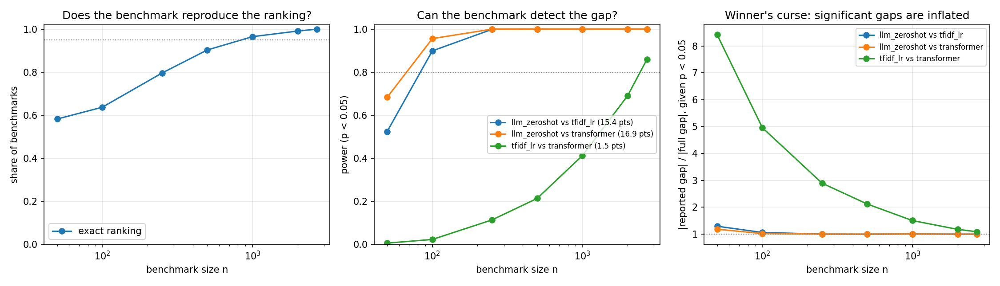

# How Much Evaluation Data Is Enough?
 
**Statistical power and ranking reliability in model benchmarks**
 
Leaderboards tell us who scored higher. This project asks when there is enough evidence to believe the ranking.
 
Three text classifiers are compared on 77-class intent detection, then the evaluation set is resampled at every size from 50 to 2,695 examples to measure how often a benchmark of that size reaches the right conclusion.
 

 
## Findings
 
**A 100-example benchmark gets the ranking right only 64% of the time.** Reproducing the full-data ranking 95% of the time takes roughly 1,000 examples.
 
**The required size depends on the comparison, not the benchmark.** The two fifteen-point gaps reach 80% power by n = 100. The 1.5-point gap between the two trained systems needs all 2,695 examples. A leaderboard is only as reliable as its closest contest: the easy comparisons are always right, so overall ranking reliability is set entirely by the hardest one.
 
**Significant results on small benchmarks are inflated.** At n = 100, when the close pair does come out significant, the reported gap overstates the full-data gap by 5.0× on average, and by 2.9× at n = 250. Only benchmarks where the gap happened to come out large clear the significance threshold, so filtering for significance filters for overestimates. This is the winner's curse (Type M error).
 
**Small benchmarks are usually right and rarely able to show it.** At n = 500, the close pair is ordered correctly 90% of the time but reaches significance only 21% of the time.
 
**Training randomness is not the bottleneck.** Retraining the transformer under five seeds moves eval accuracy by an SD of 0.001, against an example-sampling standard error of about 0.005. Sampling error stays the dominant uncertainty until n ≈ 69,000, so for this task the size of the evaluation set is the lever that matters.
 
## Results on the full evaluation set
 
n = 2,695 held-out examples.
 
| System | Accuracy | Latency per example |
|---|---:|---:|
| Fine-tuned transformer (DistilBERT) | 0.9239 | 1.20 ms |
| TF-IDF + logistic regression | 0.9087 | 0.06 ms |
| LLM zero-shot (Claude Haiku 4.5) | 0.7551 | 816 ms |
 
Pairwise comparisons, exact McNemar with Benjamini-Hochberg adjustment:
 
| Comparison | Gap | 95% CI (paired bootstrap) | Discordant | Adjusted p |
|---|---:|---:|---:|---:|
| Transformer over TF-IDF | +1.52 pts | [+0.52, +2.49] | 185 | 0.0032 |
| TF-IDF over zero-shot | +15.36 pts | [+13.62, +17.11] | 614 | < 0.0001 |
| Transformer over zero-shot | +16.88 pts | [+15.21, +18.52] | 591 | < 0.0001 |
 
All three differences are significant at full size. The transformer and TF-IDF agree on 93.1% of examples, and that low disagreement rate is why a 1.5-point gap is detectable at all: paired tests use only the examples where the systems disagree.
 
## Method
 
### Data
 
[Banking77](https://github.com/PolyAI-LDN/task-specific-datasets), 77 fine-grained customer-service intents, split into four disjoint pools with a fixed seed:
 
| Pool | n | Used for |
|---|---:|---|
| train | 9,000 | fitting TF-IDF, fine-tuning the transformer |
| val | 1,003 | epoch selection only, carved from train |
| dev | 385 | prompt development for the LLM |
| eval | 2,695 | reported results, final runs only |
 
Nothing was tuned on eval. The transformer's epoch was chosen on val, never on dev or eval. The LLM prompt was developed on dev; one version was tried and produced no invalid outputs, so no iteration was needed.
 
### Systems
 
- **TF-IDF + logistic regression.** Word 1–2-grams and character 3–5-grams, C = 10.
- **Fine-tuned transformer.** `distilbert-base-uncased` with a hand-written classification head and mean pooling, trained with an explicit PyTorch loop (AdamW, linear warmup, gradient clipping), checkpointed on val macro-F1.
- **LLM zero-shot.** Claude Haiku 4.5 at temperature 0, given the 77 intent names and asked for one label. Outputs are validated strictly: normalised, then required to match a label exactly, with no fuzzy rescue. Responses are cached so reruns are free and reproducible.
### Statistics
 
- **Exact McNemar test** on paired correct/incorrect outcomes, using the exact binomial form because discordant counts can be small.
- **Paired bootstrap** (10,000 resamples) for confidence intervals on accuracy differences, rather than a normal approximation, which underestimates uncertainty on benchmarks of this size.
- **Benjamini-Hochberg** correction across pairwise comparisons.
### The resampling experiment
 
At each size n, 1,000 benchmarks are drawn **with replacement** from the eval set and every system is scored on each. Sampling with replacement treats the eval set as a population and simulates independent benchmarks of size n. Subsets drawn without replacement would agree with the full set more and more as n grows simply because they increasingly are the full set.
 
For each size: share of benchmarks reproducing the full ranking, Kendall's tau against it, and per pair the power, sign accuracy, Type S and Type M error rates, and confidence interval width.
 
## Limitations
 
- **"Truth" is the full eval set's answer**, which is itself an estimate. The experiment measures agreement with the best available answer, not with an unknowable true ranking.
- **The eval set is assumed to represent the task.** Distribution shift between Banking77 and real traffic is a separate source of uncertainty that no benchmark size addresses.
- **One dataset, three systems.** The required sizes are specific to these gaps and disagreement rates. The pattern generalises; the numbers do not.
- **The transformer figures use a single checkpoint** scoring 0.9239. Across five controlled seeds the mean is 0.9202, which would put the gap over TF-IDF nearer 1.15 points and require a larger benchmark still.
## Reproducing
 
```bash
python data/build_eval_set.py
python run.py tfidf_lr
python -m systems.transformer            # train the checkpoint (GPU recommended)
python run.py transformer
python run.py llm_zeroshot               # requires ANTHROPIC_API_KEY, about $2
python -m evaluation.significance
python -m evaluation.subsampling
python -m evaluation.seed_variance --seeds 11 22 33 44 55
```
 
